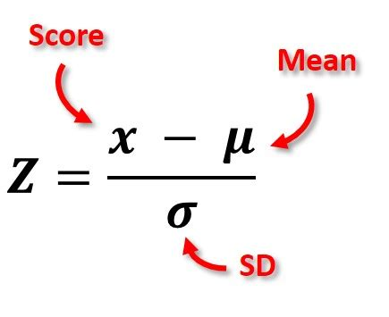

The "Z-Score" calculates how many standard deviations a value is from the mean.

A value's z-score can be used to determine whether or not it is in outlier in a given data set.

{:class="img-responsive"}
{:class="img-responsive"}
