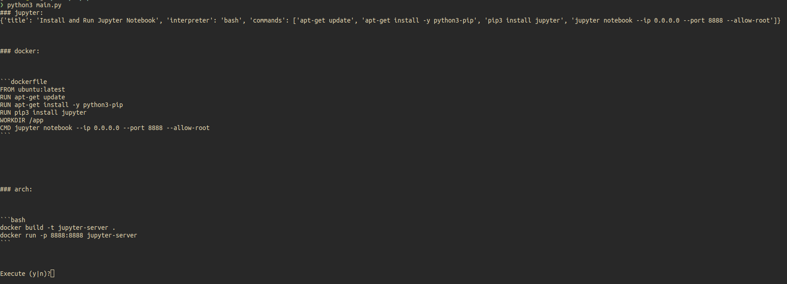

## Overview

Today I am exploring OpenAI's [function calling](https://openai.com/blog/function-calling-and-other-api-updates?ref=upstract.com) feature. This is an interesting feature that allows one to use an LLM to get back structured data. It doesn't sound like much of a change at first, but there are some pretty cool applications. With this post I am going to walk through one example that I played around with.

## Use Function Calling to Work With Docker

Recently, I have been playing around with Jupyter Notebooks. I wanted to see if I could use OpenAI's Function Calling feature to build and run a Docker image that sets up a Jupyter Notebook from scratch. Note that I am on an Arch Linux system. Here are the steps I identified in order to do so:

1. Write a script that will install Jupyter dependencies and set up a Jupyter notebook
2. Write a Dockerfile that incorporates these steps from #1
3. Generate commands that can be used to build an image from #2 and run a container from it
4. Orchestrate these function calls, adding a user-input safeguard prior to execution of the Docker commands on the host system

### Project Initialization

With this goal in mind, it was time to set up a new project:

```bash
mkdir -p openai-function-calling
cd openai-function-calling
python3 -m venv venv
source venv/bin/activate
echo 'venv' > .gitignore
git add .
git commit -m "chore(init): Initialize project"
```

### Install dependencies

There are a few requirements for this project. Here is a `requirements.txt` file to get started:

```txt
aiohttp==3.8.5
aiosignal==1.3.1
annotated-types==0.5.0
async-timeout==4.0.2
attrs==23.1.0
certifi==2023.7.22
charset-normalizer==3.2.0
frozenlist==1.4.0
idna==3.4
multidict==6.0.4
openai==0.27.8
pydantic==2.0.3
pydantic_core==2.3.0
requests==2.31.0
tqdm==4.65.0
typing_extensions==4.7.1
urllib3==2.0.4
yarl==1.9.2
```

Now, in your project's root directory, execute the following:

```bash
pip install -r requirements.txt
```

### Application Code

Create a file named `main.py` and open it using the text editor of your choice.

#### Schemas

In this code, I am using `pydantic` to build the schemas for the structured data responses from OpenAI Function Calling. This is a way to "type" the expected responses that we get back from OpenAI.

In order to use `pydantic`, simply add this import at the top of your file:

```python
from pydantic import BaseModel
```

For this example, I came up with 2 separate schemas.

**Step-By-Step Executable Commands**

```python
class StepByStepInterpreterAIResponse(BaseModel):
    title: str
    interpreter: str
    commands: list[str]
```

**Dockerfile**

```python
class DockerfileAIResponse(BaseModel):
    title: str
    dockerfile_contents: list[str]
```

#### OpenAI Function Calling

Let's create a function that can be used for each interaction with OpenAI.

This function uses the chat completion functionality to generate a response. Note that all prompts are being passed in as the `user` role. We could improve this by modifying our prompt to extract information that should be attributed to the `system`, `assistant`, or `function`. In my case the `user` role was sufficient.

**Note:** It is necessary to authenticate with OpenAI prior to making API calls. We will tackle that in a later step.

```python
from openai.openai_response import OpenAIResponse


def make_function_call(msg_content: str, desc: str, model_schema: dict[str, any]) -> OpenAIResponse:
    openai.api_key = os.getenv("OPENAI_API_KEY")
    response = openai.ChatCompletion.create(
        model="gpt-3.5-turbo-0613",
        messages=[
           {"role": "user", "content": msg_content}
        ],
        functions=[
            {
              "name": "get_answer_for_user_query",
              "description": desc,
              "parameters": model_schema,
            }
        ],
        function_call={"name": "get_answer_for_user_query"}
    )
    output = json.loads(response.choices[0]["message"]["function_call"]["arguments"])
    return output
```

#### Jupyter Script

Now we're getting to the exciting part!

In this step we'll define the code necessary to make our first function calling API call.

Remember our function signature expects 3 parameters:

1. `msg_content` - This is the prompt that we're passing in from the `user` role.
2. `desc` - This is the function description. It provides additional context around our Function Calling function.
3. `model_schema` - This is the schema that our Function Calling function should adhere to.

**Jupyter Script Function Call**

```python
def generate_jupyter_notebook(port: str) -> StepByStepInterpreterAIResponse:
    # Use OpenAI Function Calling to get step-by-step commands necessary to build a Jupyter Notebook on an Ubuntu system
    script_msg = f"Write me a script to install and run a jupyter notebook. The notebook should run on port {port} and support running as root user."
    script_desc = "Using any interpreter, as defined by the 'interpreter' field, provide step by step commands that will answer the user provided query. The 'commands' should be executable steps that will accomplish the goal as defined by the user query. Note that these commands will be run as a script inside an Ubuntu Docker container."
    script_model_schema = StepByStepInterpreterAIResponse.model_json_schema()
    jupyter_script: StepByStepInterpreterAIResponse = make_function_call(script_msg, script_desc, script_model_schema)
    print("### jupyter:")
    print(jupyter_script)
    return jupyter_script
```

#### Dockerfile

In this step we will use the commands in our response from our Jupyter Script API call to help generate a `Dockerfile`.

We'll be writing our response to a text file on the host system. For this we'll need to import another module:

```python
import os
```

Note that in our schema we defined the response `dockerfile_contents` as a list of `str`. We'll expect each line as one item in this list. In my code, I'm both writing these lines directly to our `Dockerfile` and outputting them to the screen via `stdout`.

```python
def generate_dockerfile(jupyter_script: StepByStepInterpreterAIResponse, port: str) -> DockerfileAIResponse:
    # Use OpenAI Function Calling to write a Dockerfile
    docker_msg = f"Write me a Dockerfile to for an Ubuntu Docker container. The jupyter server should be accessible to the host. Include the following commands, which should be run as part of the build. Commands: {jupyter_script['commands']}"
    docker_desc = "Please answer the user provided question. Note that the output from a separate function call is being included, and should be used to help generate the response."
    docker_model_schema = DockerfileAIResponse.model_json_schema()
    dockerfile: DockerfileAIResponse = make_function_call(docker_msg, docker_desc, docker_model_schema)

    print("\n\n\n### docker:")
    print("\n\n\n```dockerfile")
    file = open("Dockerfile", "w+")
    for line in dockerfile["dockerfile_contents"]:
        print(line)
        file.write(f"{line}\n")
    print("```\n\n\n")
    file.close()
    return dockerfile
```

#### Host Commands

Great! We now have:

1. A script for setting up a Jupyter Notebook from an Ubuntu host
2. A `Dockerfile` to build an image from an Ubuntu base that uses the commands from #1 to set up the Jupyter Notebook.

Now we will make one last OpenAI Function Calling API call to get some commands that can be executed from the host to build and run our container. The prompt for this API call took a few tries. In my first attempts I was getting non-executable steps in my response, which were valid, but I was looking for commands that could be executed directly by my shell. I revised the prompt to explain this, and subsequent calls yielded better responses.

Also in this block of code is a checkpoint where I ask for user input to confirm whether or not we wish to execute the commands returned from OpenAI. This is an interesting problem that I'm sure many have run into (and will continue running into). We have a goal of full automation, but with full automation of non-deterministic commands there will always be some risk.

```python
def generate_host_commands(dockerfile: DockerfileAIResponse, port: str) -> None:
    # Use OpenAI Function Calling to generate Arch Linux commands to build and run a container from the Dockerfile
    arch_msg = f"I am on an Arch linux system and I have a Dockerfile named Dockerfile that I wish to build an image from, then run a container using this image. The jupyter server will run on port {port}. The Dockefile exists in the current directory. Note that all commands in the response will be executed directly, so do not provide examples of additional comments that are not expected to be run as-is. What are the step-by-step commands that I can use to accomplish this? Here is the Dockerfile contents: {dockerfile['dockerfile_contents']}"
    arch_desc = "Please anser the user provided question. The answer should be step-by-step instructions, providing commands that can be run by the interpreter in the response, to complete the question as defined by the user."
    arch_model_schema = StepByStepInterpreterAIResponse.model_json_schema()
    arch = make_function_call(arch_msg, arch_desc, arch_model_schema)

    print("\n\n\n### arch:")
    print(f"\n\n\n```{arch['interpreter']}")
    for command in arch["commands"]:
        print(command)
    print("```\n\n\n")

    res_input = input("Execute (y|n)?")
    if res_input == "y":
        for command in arch["commands"]:
            os.system(command)
```

### Orchestration

Now it's time to piece the code together. I did this by defining a function called `orchestrate` function, where I simply call the functions for each step as defined above, passing responses from previous steps into the following steps. I also use an `OPENAI_API_KEY` environment variable to authenticate with OpenAI. In other applications, I've often used `python-dotenv` for secret management. The env var will be fine in this use case.

```python
def orchestrate() -> None:
    # authenticate with OpenAI
    openai.api_key = os.getenv("OPENAI_API_KEY")

    port = "8888"
    # make OpenAI Function Calling API calls
    jupyter_script = generate_jupyter_notebook(port)
    dockerfile = generate_dockerfile(jupyter_script, port)
    generate_host_commands(dockerfile, port)
```

I then called the `orchestrate` function like this:

```python
if __name__ == "__main__":
    orchestrate()
```

### Execution

Now our script is complete. For easy copy/paste, see the full script below. Save your file and start your execution:

```python
python3 main.py
```

When prompted, carefully review the script output. If you are comfortable and wish to proceed, enter `y` and press "Enter."

#### Script Output



#### Container


#### Jupyter Server


#### Full Script

```python
from openai.openai_response import OpenAIResponse
from pydantic import BaseModel
import openai
import os
import json


class DockerfileAIResponse(BaseModel):
    title: str
    dockerfile_contents: list[str]


class StepByStepInterpreterAIResponse(BaseModel):
    title: str
    interpreter: str
    commands: list[str]


def make_function_call(msg_content: str, desc: str, model_schema: dict[str, any]) -> OpenAIResponse:
    response = openai.ChatCompletion.create(
        model="gpt-3.5-turbo-0613",
        messages=[
           {"role": "user", "content": msg_content}
        ],
        functions=[
            {
              "name": "get_answer_for_user_query",
              "description": desc,
              "parameters": model_schema,
            }
        ],
        function_call={"name": "get_answer_for_user_query"},
    )
    output = json.loads(response.choices[0]["message"]["function_call"]["arguments"])
    return output


def generate_jupyter_notebook(port: str) -> StepByStepInterpreterAIResponse:
    # Use OpenAI Function Calling to get step-by-step commands necessary to build a Jupyter Notebook on an Ubuntu system
    script_msg = f"Write me a script to install and run a jupyter notebook. The notebook should run on port {port} and support running as root user."
    script_desc = "Using any interpreter, as defined by the 'interpreter' field, provide step by step commands that will answer the user provided query. The 'commands' should be executable steps that will accomplish the goal as defined by the user query. Note that these commands will be run as a script inside an Ubuntu Docker container."
    script_model_schema = StepByStepInterpreterAIResponse.model_json_schema()
    jupyter_script: StepByStepInterpreterAIResponse = make_function_call(script_msg, script_desc, script_model_schema)
    print("### jupyter:")
    print(jupyter_script)
    return jupyter_script


def generate_dockerfile(jupyter_script: StepByStepInterpreterAIResponse) -> DockerfileAIResponse:
    # Use OpenAI Function Calling to write a Dockerfile
    docker_msg = f"Write me a Dockerfile to for an Ubuntu Docker container. The jupyter server should be accessible to the host. Include the following commands, which should be run as part of the build. Commands: {jupyter_script['commands']}"
    docker_desc = "Please answer the user provided question. Note that the output from a separate function call is being included, and should be used to help generate the response."
    docker_model_schema = DockerfileAIResponse.model_json_schema()
    dockerfile: DockerfileAIResponse = make_function_call(docker_msg, docker_desc, docker_model_schema)

    print("\n\n\n### docker:")
    print("\n\n\n```dockerfile")
    file = open("Dockerfile", "w+")
    for line in dockerfile["dockerfile_contents"]:
        print(line)
        file.write(f"{line}\n")
    print("```\n\n\n")
    file.close()
    return dockerfile


def generate_host_commands(dockerfile: DockerfileAIResponse, port: str) -> None:
    # Use OpenAI Function Calling to generate Arch Linux commands to build and run a container from the Dockerfile
    arch_msg = f"I am on an Arch linux system and I have a Dockerfile named Dockerfile that I wish to build an image from, then run a container using this image. The jupyter server will run on port {port}. The Dockefile exists in the current directory. Note that all commands in the response will be executed directly, so do not provide examples of additional comments that are not expected to be run as-is. What are the step-by-step commands that I can use to accomplish this? Here is the Dockerfile contents: {dockerfile['dockerfile_contents']}"
    arch_desc = "Please anser the user provided question. The answer should be step-by-step instructions, providing commands that can be run by the interpreter in the response, to complete the question as defined by the user."
    arch_model_schema = StepByStepInterpreterAIResponse.model_json_schema()
    arch = make_function_call(arch_msg, arch_desc, arch_model_schema)

    print("\n\n\n### arch:")
    print(f"\n\n\n```{arch['interpreter']}")
    for command in arch["commands"]:
        print(command)
    print("```\n\n\n")

    res_input = input("Execute (y|n)?")
    if res_input == "y":
        for command in arch["commands"]:
            os.system(command)


def orchestrate() -> None:
    # authenticate with OpenAI
    openai.api_key = os.getenv("OPENAI_API_KEY")

    port = "8888"
    # make OpenAI Function Calling API calls
    jupyter_script = generate_jupyter_notebook(port)
    dockerfile = generate_dockerfile(jupyter_script)
    generate_host_commands(dockerfile, port)

if __name__ == "__main__":
    orchestrate()
```


* Final Note that we are using the default `temperature` of 0.2, which determines how random or deterministic our response will be. This means that it is possible for a subsequent execution to get a different response, which may or may not work exactly as expected. 
